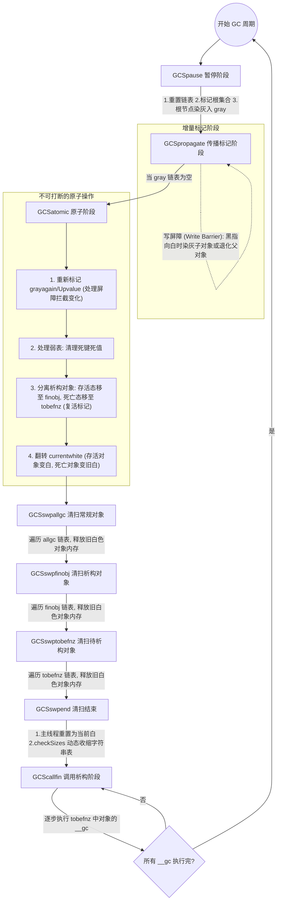

# Lua 5.3 垃圾回收 (GC) 机制的C实现笔记

## 0. Lua GC 完整周期流程图

为了将内存管理、三色标记、状态机流转和写屏障等知识点串联起来，以下是一个完整的 GC 周期逻辑图：



## 1. Lua 的内存管理基础

在深入 GC 流程前，必须理清 Lua 内存的区域划分。Lua 的内存大致可以分为**栈（Stack）**和**堆（Heap）**两个管理区域：

### 1.1 栈区域 (Stack)
- **管理方式**：每个 `lua_State` 都有一个独立的栈（`stack` 指针指向的内存）。
- **存储对象**：存放 `TValue` 结构。基本类型（如整数、浮点数、布尔值）直接存储在 `TValue` 的 `Value` 联合体中。
- **GC 角色**：栈上的基本类型数据**不需要** GC 机制照看。当函数返回或变量超出作用域，栈指针移动即可复用内存。

### 1.2 堆区域 (Heap)
- **存储对象**：存放所有受 GC 管理的对象（如 `Table`, `TString`, `Closure`, `Userdata`, `Proto`, `Thread`）。
- **关联方式**：栈上的 `TValue` 通过 `value_.gc` 指针指向堆中的这些对象。
- **GC 角色**：GC 机制的核心任务就是管理堆内存的申请与释放。

### 1.3 实例分析
```lua
local var = 7             -- 1. var 是基本类型，7 直接存在栈上的 TValue 中 (lua_Integer)
local str = "hello"       -- 2. "hello" 存在堆中 (TString)，栈上的 TValue.gc 指向它
local tbl = {1, var}      -- 3. tbl 存在堆中 (Table)，其 array 指向一块连续堆内存。
                          --    注意：tbl[2] 是 var 的值拷贝，而非引用。
var = nil                 -- 4. 栈上的 var 被标记为可覆盖，原来的 7 不需要回收，直接覆盖即可。
```

### 1.4 对象的创建与销毁
- **创建**：像 Table、String 这些对象在创建时（如 `luaH_new`），会默认被标记为**“当前白”**（`global_State.currentwhite`）。
- **销毁**：以 Table 为例，回收时会调用 `luaH_free`，它不仅释放 Table 结构体本身，还会递归释放其散列部分（node）和数组部分（array）的内存。

```c
/* 释放 Table 对象的内存 */
void luaH_free (lua_State *L, Table *t) {
  if (!isdummy(t)) /* 如果 hash part 不为空 */
    luaM_freearray(L, t->node, cast(size_t, sizenode(t))); /* 释放 hash part 的 node 数组 */
  luaM_freearray(L, t->array, t->sizearray); /* 释放 array part 的内存 */
  luaM_free(L, t); /* 释放 Table 结构体自身的内存 */
}
```

## 2. 基础数据结构与三色标记

在 Lua 中，所有受 GC 管理的对象（如 Table、String、Function 等）都会包含一个 `CommonHeader`，它们通过这个头部被组织在各种链表中。

```c
/* CommonHeader 宏定义了所有需要进行垃圾回收的对象的通用头部 */
#define CommonHeader    GCObject *next; lu_byte tt; lu_byte marked

/* GCObject 联合体，用于类型转换 */
struct GCObject {
  CommonHeader;
};
```
- `next`: 链表指针，用于将对象连接到如 `allgc`, `finobj` 等链表上。
- `tt`: 对象的类型（如 `LUA_TTABLE`, `LUA_TSTRING`）。
- `marked`: GC 标记位，用于记录对象的颜色及其他 GC 状态。

### 1.1 三色标记状态 (`marked` 字段)

Lua 将对象分为三种基本颜色：
- **白色（White）**：表示对象尚未被 GC 访问到。如果在标记阶段结束时仍为白色，说明该对象不可达，将被清除。
  - Lua 巧妙地使用了**双白色（White0 和 White1）**机制。每次 GC 循环使用其中一种白色作为“当前白色”（由 `global_State.currentwhite` 记录），另一种作为“旧白色”。这可以防止在 GC 扫描过程中新创建的对象（初始为当前白色）被错误地清除。
- **灰色（Gray）**：表示对象自身已被访问并标记，但它引用的其他对象尚未被完全访问（如一个 Table 被标记了，但它的 key/value 还没被扫描）。灰色对象会被放入 `gray` 或 `grayagain` 链表。
- **黑色（Black）**：表示对象自身已被访问，且它引用的所有对象也已被访问过。黑色对象在本次 GC 周期内是安全的，不会被清除。

```c
/* 标记位的布局与位运算宏 (来自旧笔记，包含详细位映射) */
#define WHITE0BIT       0  /* object is white (type 0) 对应marked的二进制值是 01 */
#define WHITE1BIT       1  /* object is white (type 1) 对应marked的二进制值是 10 */
#define BLACKBIT        2  /* object is black 对应marked的二进制值是 100 */
#define FINALIZEDBIT    3  /* object has been marked for finalization 对应marked的二进制值是 1000 */

#define WHITEBITS       bit2mask(WHITE0BIT, WHITE1BIT) /* WHITEBITS = 11(二进制) */

/* Lua定义了用来判断marked的值（gc对象的颜色）的宏，用的都是位操作，高级👍 */

#define testbits(x,m)           ((x) & (m)) /* 这个宏用来一次性检测多个bit，所以宏名称里面是bits */
#define bitmask(b)              (1<<(b))
#define bit2mask(b1,b2)         (bitmask(b1) | bitmask(b2))
#define testbit(x,b)            testbits(x, bitmask(b)) /* 这个宏用来检测单个bit，所以宏的名称只有bit，没有bits */

#define iswhite(x)      testbits((x)->marked, WHITEBITS) /* 检测marked二进制值的最低两位是否有一位是1 */
#define isblack(x)      testbit((x)->marked, BLACKBIT) /* 检测marked的二进制值的第3位（低位）是否是1 */
#define isgray(x)  /* neither white nor black */  \
        (!testbits((x)->marked, WHITEBITS | bitmask(BLACKBIT))) /* 检测marked的二进制值的低3位是否全是0 */

/* 检查对象是否为“死对象”（其白色标记与当前全局的 currentwhite 不同） */
#define isdeadm(ow,m)   (!(((m) ^ WHITEBITS) & (ow)))
#define isdead(g,v)     isdeadm(otherwhite(g), (v)->marked)
```

## 2. GC 运行的生命周期

Lua 的 GC 是增量执行的，主要入口是 `singlestep` 函数。GC 的各个阶段由 `global_State` 的 `gcstate` 字段控制。

```c
static lu_mem singlestep (lua_State *L) {
  global_State *g = G(L);
  switch (g->gcstate) {
    case GCSpause: {      /* 暂停阶段：准备开启新的一轮 GC */
      g->GCmemtrav = g->strt.size * sizeof(GCObject*);
      restartcollection(g);
      g->gcstate = GCSpropagate;
      return g->GCmemtrav;
    }
    case GCSpropagate: {  /* 传播/标记阶段：遍历灰色对象，将其引用标灰，自身标黑 */
      g->GCmemtrav = 0;
      lua_assert(g->gray);
      propagatemark(g);
       if (g->gray == NULL)  /* 如果灰色链表为空，传播阶段结束 */
        g->gcstate = GCSatomic;
      return g->GCmemtrav;  /* 返回这一步遍历的内存大小 */
    }
    case GCSatomic: {     /* 原子阶段：一次性处理弱表、重新标记等，翻转白色标记 */
      lu_mem work;
      propagateall(g);    /* 确保灰色链表真的为空 */
      work = atomic(L);   /* 执行原子操作，此时不能被打断 */
      entersweep(L);      /* 准备进入扫除阶段 */
      g->GCestimate = gettotalbytes(g);  /* 估算存活对象的内存大小 */;
      return work;
    }
    case GCSswpallgc: {   /* 清扫阶段 1：清扫 allgc 链表中的常规对象 */
      return sweepstep(L, g, GCSswpfinobj, &g->finobj);
    }
    case GCSswpfinobj: {  /* 清扫阶段 2：清扫 finobj 链表中带析构函数的对象 */
      return sweepstep(L, g, GCSswptobefnz, &g->tobefnz);
    }
    case GCSswptobefnz: { /* 清扫阶段 3：清扫 tobefnz 链表（准备被析构的对象） */
      return sweepstep(L, g, GCSswpend, NULL);
    }
    case GCSswpend: {     /* 清扫结束：重置主线程颜色并收缩字符串表 */
      /* 必须将主线程重新标记为当前白。
         因为在 Propagate 阶段它被染黑了，如果不重置，
         下一轮 GC 循环 markobject(mainthread) 会因为对象不是白色而跳过，
         导致无法扫描栈上的根节点，从而引发内存错误！ */
      makewhite(g, g->mainthread);

      /* 动态收缩字符串表 (checkSizes) */
      checkSizes(L, g);
      g->gcstate = GCScallfin;
      return 0;
    }
    case GCScallfin: {    /* 调用析构函数（__gc）阶段 */
      if (g->tobefnz && g->gckind != KGC_EMERGENCY) {
        int n = runafewfinalizers(L); /* 每次执行少量的 __gc 方法 */
        return (n * GCFINALIZECOST);
      }
      else {  /* 所有 finalizers 执行完毕，回到 Pause 状态 */
        g->gcstate = GCSpause;  /* 结束这一轮 GC 收集 */
        return 0;
      }
    }
    default: lua_assert(0); return 0;
  }
}

> **补充：`checkSizes` 的作用及收缩字符串表的意义**
> 在清扫阶段结束后，Lua 已经释放了大量不可达对象（包括字符串）。
> 1. **节约内存**：字符串哈希表 (`global_State.strt`) 如果维持在高峰期的大小，会占用不必要的内存。
> 2. **提升性能**：哈希表过大会导致 Hash 桶过于稀疏。`checkSizes` 会检查：如果当前使用的字符串数量 (`nuse`) 小于哈希表容量 (`size`) 的 1/4，就调用 `luaS_resize` 将表大小**缩减一半**。
> 3. **缓存友好**：更紧凑的哈希表能提高 CPU 缓存命中率，使后续的字符串查找和插入更高效。
```

### 2.1 标记阶段 (Pause -> Propagate)
`restartcollection` 是 GC 标记的起点，主要是清理灰色相关的链表，并**标记根集合 (Root Set)**。根集合包含：主线程(main thread)、注册表(registry)和全局元表等。
```c
static void restartcollection (global_State *g) {
  g->gray = g->grayagain = NULL;
  g->weak = g->allweak = g->ephemeron = NULL;
  markobject(g, g->mainthread); /* 标记主线程，将其变成灰色并放入 gray 链表 */
  markvalue(g, &g->l_registry); /* 标记注册表 */
  markmt(g);                    /* 标记基本类型的 metatable */
  markbeingfnz(g);              /* 标记上一个周期遗留下来的等待 finalization 的对象 */
}
```
当标记了一个对象，它会被变为灰色，并加入 `gray` 链表。
随后进入 `GCSpropagate` 阶段，通过 `propagatemark` 不断从 `gray` 链表中取出对象，标记它的子对象（子对象变灰），并将该对象自身变为黑色。

### 2.2 原子阶段 (Atomic)
由于 Lua GC 是增量的，在 Propagate 阶段执行期间，用户代码可能会修改已扫描过的对象关系（例如黑色对象指向了新的白色对象）。为了解决这个问题，有了原子阶段：
- **`propagateall`**: 首先处理遗留的 `grayagain` 链表，确保所有被写屏障拦截的变化都被处理。
- **清理弱表 (Weak Tables)**: 清理死键死值。
- **分离析构对象**: 将带有 `__gc` 且已经死亡的对象从 `finobj` 移动到 `tobefnz`。
- **翻转全局当前白色 (`currentwhite`)**: 这一步非常关键。翻转后，原本存活的对象（黑色）会在清扫阶段被重新变回新的当前白色；而死亡的对象仍然保持着“旧白色”标记，从而在扫除阶段被识别并回收。

### 2.3 清扫阶段 (Sweep)
清扫阶段遍历几个主要的链表 (`allgc`, `finobj`, `tobefnz`)。
```c
static GCObject **sweeplist (lua_State *L, GCObject **p, lu_mem count) {
  global_State *g = G(L);
  int ow = otherwhite(g); /* 获取旧白色 */
  int white = luaC_white(g);  /* 获取当前白色 */
  while (*p != NULL && count-- > 0) {
    GCObject *curr = *p;
    int marked = curr->marked;
    if (isdeadm(ow, marked)) {  /* 如果对象的颜色是旧白色，说明它是死对象 */
      *p = curr->next;          /* 将它从链表中移除 */
      freeobj(L, curr);         /* 释放内存（对于 table 会释放其 hash/array 节点等） */
    }
    else {  /* 对象存活，将颜色重置为当前白，为下一次 GC 循环做准备 */
      curr->marked = cast_byte((marked & maskcolors) | white);
      p = &curr->next;
    }
  }
  return (*p == NULL) ? NULL : p;
}
```

## 3. 带有析构函数 (__gc) 的对象处理

如果一个 Table 或 Userdata 包含 `__gc` 元方法，它的生命周期会有所不同。
1. 当调用 `setmetatable` 时，`luaC_checkfinalizer` 会被调用。如果检测到有 `__gc`，对象会从全局的 `allgc` 链表移动到 `finobj` 链表。
2. 在 GC 原子阶段，若 `finobj` 中的对象不可达了，它会被移动到 `tobefnz` (to-be-finalized) 链表，同时被**重新复活（标记并传染）**，防止其在调用 `__gc` 前被释放内存。
3. 在 `GCScallfin` 阶段，Lua 会逐步调用 `tobefnz` 链表中对象的 `__gc` 函数。调用后，对象失去 `FINALIZEDBIT` 标志，并被放回 `allgc` 链表。
4. 在**下一个** GC 周期中，如果该对象仍然不可达，才会被真正作为普通死对象从 `allgc` 链表中清扫并释放内存。

## 4. 写屏障 (Write Barrier) 机制

**为什么需要写屏障？**
增量 GC 中，“黑色对象永远不能直接指向白色对象”。但在 Lua 脚本执行赋值操作（如 `A.x = B`）时，有可能 A 已经被扫描完变成了黑色，而 B 是新创建的白色对象或者尚未扫描的白色对象。如果不作干预，B 就会在清扫阶段被错误地当做垃圾回收掉。

为了维护三色不变性，Lua 引入了写屏障：
### 向前屏障 (Barrier Forward)
将新关联的白色对象**染成灰色**，这样 GC 就会去扫描并保护这个对象。
```c
/* 将白色对象 v 染灰，保持“黑色不能指向白色”的原则 */
void luaC_barrier_ (lua_State *L, GCObject *o, GCObject *v) {
  global_State *g = G(L);
  lua_assert(isblack(o) && iswhite(v) && !isdead(g, v) && !isdead(g, o));
  if (keepinvariant(g))  /* 必须保持不变性（通常是处于标记阶段） */
    reallymarkobject(g, v);  /* 恢复不变性：将白色对象 v 变灰 */
  else {  /* 清扫阶段 */
    lua_assert(issweepphase(g));
    makewhite(g, o);  /* 清扫阶段可以直接将黑色父对象退化为白色 */
  }
}
```

### 向后屏障 (Barrier Backward)
将原本的黑色对象**退化为灰色**（放入 `grayagain` 链表）。这主要用于 Table，因为 Table 会频繁更新，如果每次赋值都对被赋的值进行 Forward Barrier，开销会很大。退回灰色意味着原子阶段它会被重新扫描。
```c
void luaC_barrierback_ (lua_State *L, Table *t) {
  global_State *g = G(L);
  lua_assert(isblack(t) && !isdead(g, t));
  black2gray(t);  /* 将 Table t 由黑退回为灰 */
  linkgclist(t, g->grayagain); /* 将其挂入 grayagain 链表，等待原子阶段处理 */
}
```

**总结：**
- `luaC_barrier_` (Forward) 多用于 Userdata 或 Upvalue 等更新频率不高的对象。
- `luaC_barrierback_` (Backward) 专门用于 Table 的字段更新。
