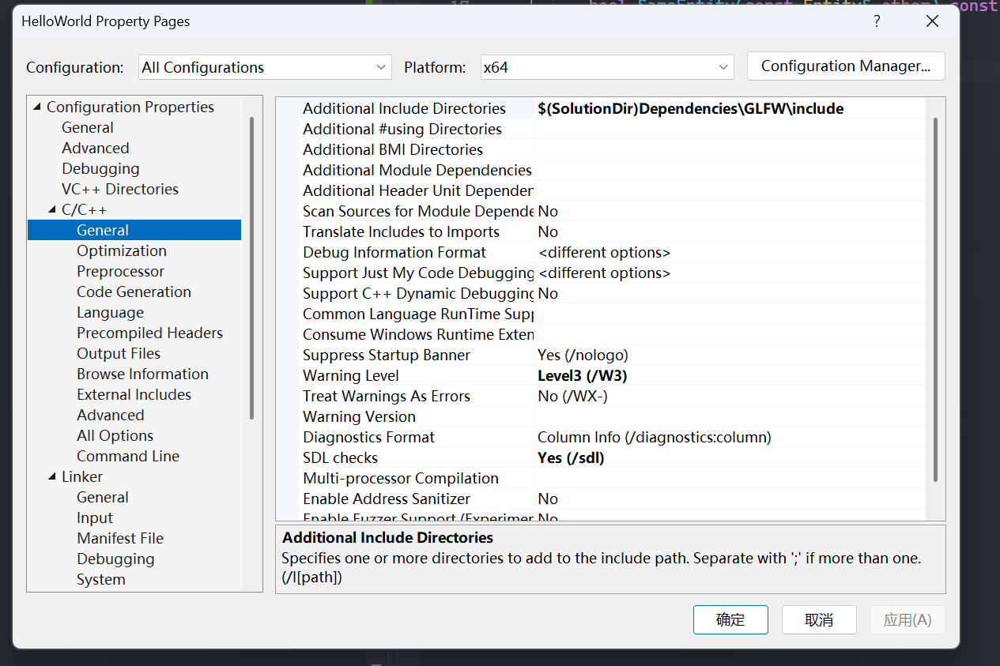
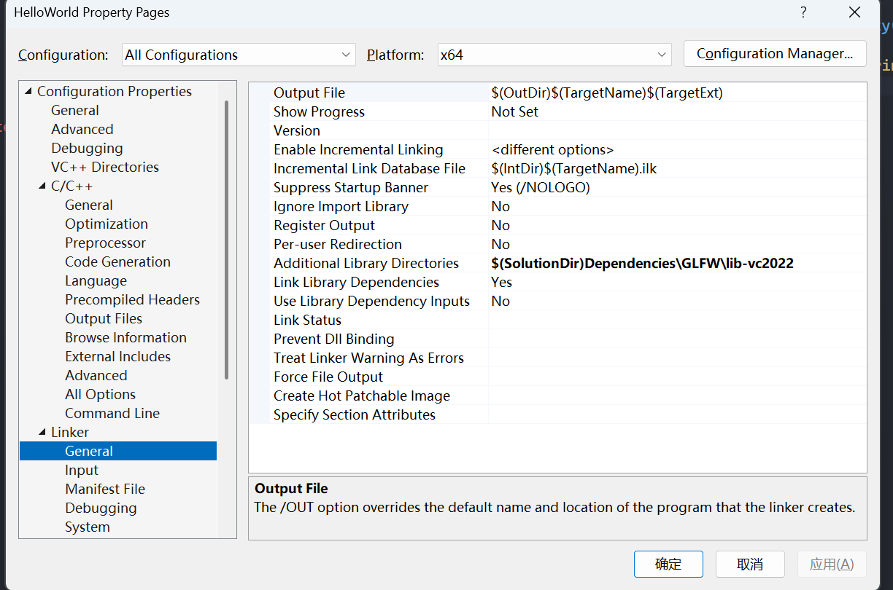
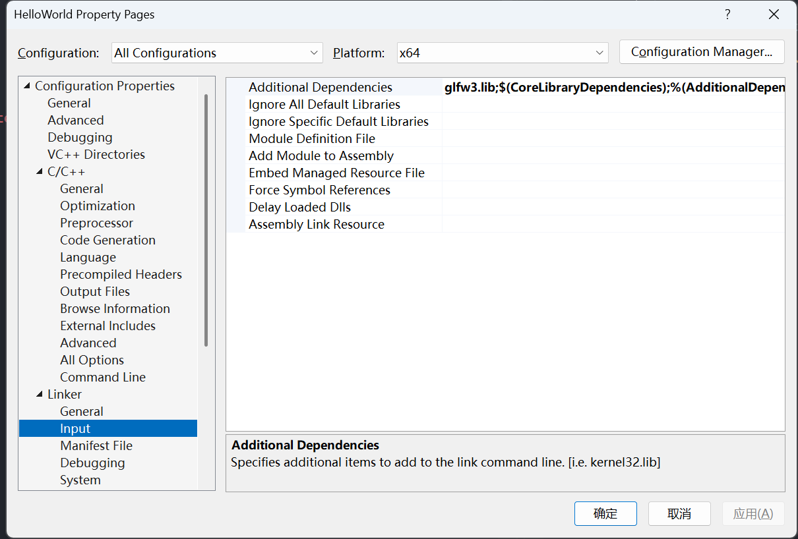
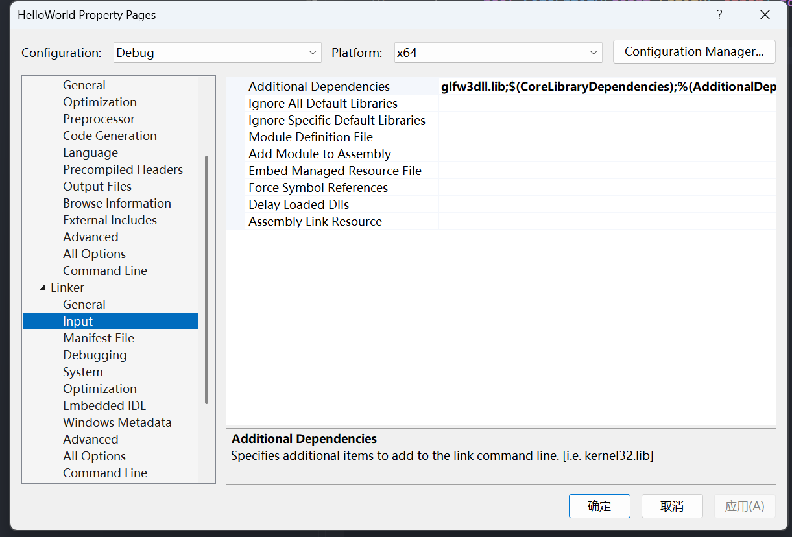
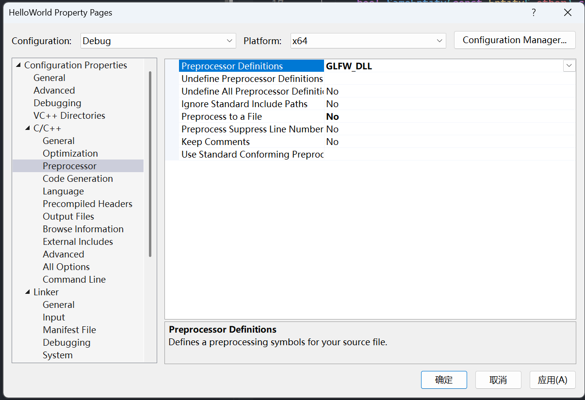
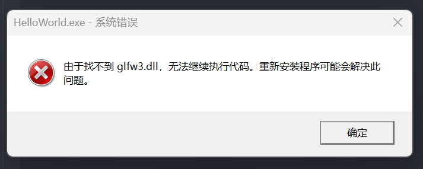
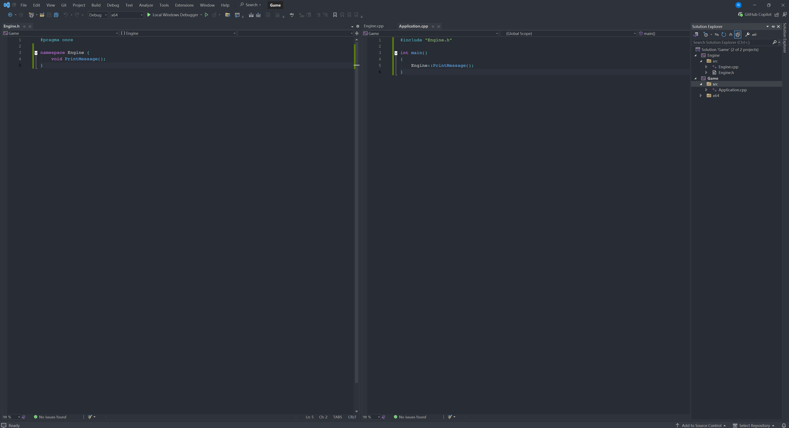
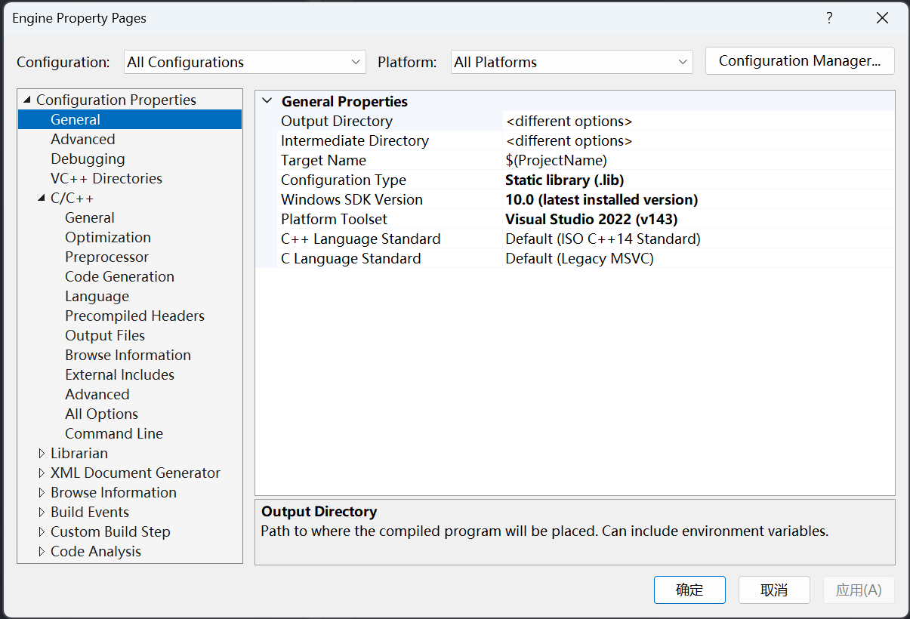
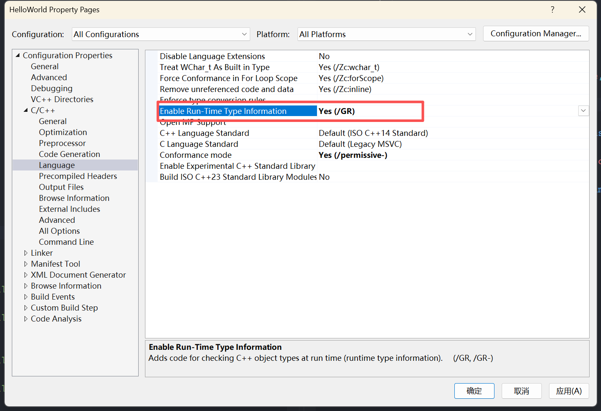

# TheCherno C++ Lessons

## How The C++ Compiler Works

### C++ Compiler's responsibility

1. pre-processing .cpp file such as #include(copy & paste), #define, #if #ifdef

2. generate .obj file for every compiling unit.

3. optimize your code.

### An example of what ```#include``` doing (trust me, it's just coping and pasting)

Suppose now we have these two source files.

```C++ {.line-numbers}
// Math.h
}

// Yes, this file just have an end brace, nothin else.

// Main.cpp

int main()
{
    int reuslt = 1;
#include "Math.h"

```

Press ctrl + F7 and compile the Main.cpp and ***you will find that the compiling is successful!!!***

Select Project -> Properties -> C/C++ -> Preprocess -> Preprocess to a file -> Yes

Press ctrl + F7 to re-compile the Main.cpp

Now you can find Main.i file in the following path:

```Bash
D:\GitLab\Repo\C++\HelloWorld\HelloWorld\x64\Debug
```

Open this Main.i, you can see that:

```C++ {.line-numbers}
#line 1 "D:\\GitLab\\Repo\\C++\\HelloWorld\\HelloWorld\\Mian.cpp"

int main()
{
    return 0;
#line 1 "D:\\GitLab\\Repo\\C++\\HelloWorld\\HelloWorld\\Math.h"
}
#line 6 "D:\\GitLab\\Repo\\C++\\HelloWorld\\HelloWorld\\Mian.cpp"
```

Yes, the compiler copied the whole Math.h file and pasted where the ```#include``` is. Simply lovely.

### What is compiling unit, is it true that a .cpp file is a compiling unit?

Generally, a compiling unit will produce a .obj file.

But it doesn't mean that a .cpp file is a compiling unit.

A .cpp file is just something that we can feed code to the compiler.

Actually a .cpp file can be serveral compile units.

Yes, you can ```#include``` serveral .cpp files a .cpp file. See <https://chatgpt.com/share/68286e49-7274-800f-8b34-3b705777d0b8>

### An example that compiler can optimize your code

Suppose that we have this source file:

```C++ {.line-numbers}
// Math.cpp
int Add()
{
    return 5 + 2;
}
```

1. Select ***Project -> HelloWorld properties -> C/C++ -> Optimization -> Maximum Optimization(Favor Speed)***

2. Remember to close basic runtim check by selecting ***Project -> HelloWorld properties -> C/C++ -> Code Generation -> Basic Runtime Check -> Default***. Otherwise, you may get a "Build Failed".

3. Select ***Project -> HelloWorld properties -> C/C++ -> Output Files -> Assembler output -> Assembly Only Listing.***

Now, you can see a Math.asm file in the path :

```Bash
D:\GitLab\Repo\C++\HelloWorld\HelloWorld\x64\Debug
```

And from this assembly file, you can see the assembly code of function Add :

```C++ {.line-numbers}
?Add@@YAHXZ PROC; Add, COMDAT
; File D:\GitLab\Repo\C++\HelloWorld\HelloWorld\Math.cpp
; Line 2
$LN4:
    sub rsp, 40; 00000028H
    lea rcx, OFFSET FLAT:__67D1A559_Math@cpp
    call    __CheckForDebuggerJustMyCode
    mov eax, 7
; Line 4
    add rsp, 40; 00000028H
    ret 0
?Add@@YAHXZ ENDP; Add
_TEXT  ENDS
END
```

You can see that the compiler computed the result of 5 + 2 while compiling instead of storing the constant values 5 and 2 in the register :

```C++ {.line-numbers}
mov eax, 7
```

This kind of optimization is so-called "constant folding".

## Variables in C++

### How much space does a boolean variable take in memory?

Actually, although 1 bit of memory space is enough for a boolean to present, it takes 1 byte of space in memory.

Because **computer addressing memory by byte, not by bit**, that's it.

## C++ Header Files

### What is the difference between head files with .h extension and head files without?

Head files with .h head files are c head files, otherwise, they are c++ head files. Commonly seen in the c standard libs header files and c++ standard libs header files.

## How to debug C++ in Visual Studio 2022

### Viewing memory

```C++ {.line-numbers}
int main()
{
	int variable = 17;
    variable++;

    return 0;
}
```

Add a breakpoint in the following line (**<font color="gold">remeber to turn off the optimization!!!</font>**):

```C++ {.line-numbers}
variable++;
```

Start debuging, stop at the breakpoint.

Choose Debug -> Windows -> Memory -> Memory 1/2/3

Type "&variable" inside "Adress" -> Enter

Now you should see the memory content of the variable "variable" below.


### Viewing Disassembly Code

**<font color = "gold">Under debug, when your program runs into a breakpoint</font>**，you can check the assemably code by two ways.

One way by right clicking the mouse and selecting the "Go to Disassembly" option of the menu.

Another way is the shortcut-keys way. Press Ctrl+K, and then press G. Remeber releasing after pressing Ctrl+K.

You can see the following window if there's no accidents.


## Setup Your C++ Projects in Visual Studio 2022

### Filters VS Folders

There are filters in Visual Studio. Filters are something that Visual Studio helps you to classify your files. They are not existed in your disk.

Folders are real folders that created actual folders in your disk.

Your can treat filters as virtual folders.

The following button provides you a way to switch between filters'view and folders'view.


### Setup Directories For Different Kinds Of Output Files

Two output directoires are suggested to config in order to manager your project.

The first one is the "Output Directory", and the secord one is the "Intermediate Directory".

Choose Project -> YourProject Properties -> General

Setup the above configurations as the following:


You can check the meanings of all the macros that vs 2022 provides for you here.


## Pointer VS Reference

|feature|pointer|reference|
|-------|-------|---------|
|can be null|yes|no, **must be binded after created**|
|can be rebinded|yes|no, **can be binded just one time**|
|usage|*/&|just like a variable|
|initialization|no need to initialize when created|**must be initialized when created**|
|space|take up space in memory(32 bits for 32-bit applications, 64 bits for 64-bit applications)|**no space occupied in memeory**|

see: <https://chatgpt.com/s/t_6857c520e1b0819191a1d525ce030d7a>

## Static in C++

### Staic Outside Class And Struct

Static variables or functions outside class and struct. This kind of variables or functions can be used within the compiling unit where they are defined for linking. For example:

```C++ {.line-numbers}
// math.cpp
static int s_Variable = 7; // s_Varible can be "seen" by the linker within this file
int g_Variable = 77; // g_Variable is a global variable and can be "seen" across different cpp files (or compiling unit)

// main.cpp
...
static int s_Variable = 17;
extern int g_Variable; // important, witouth this statement, we'll get an error, undefined idtifiner

int main()
{
   cout << s_Variable << endl; // print 17
   cout << g_Variable << endl; // print 77 
}

```

If

```C++ {.line-numbers}
// math.cpp
static int s_Variable = 7;
int g_Variable = 10;

// log.cpp
int g_Variable = 17;

// main.cpp
...
extern g_Variable;
int main()
{
   cout << g_Variable << endl; // linking error : one or more multiply defined symbols found 
}
```

Anyway, "static" can be treated like "private" of class and struct. Just remember that static variables and functions have internal linkage. **And this means that you should not declare static variabels or functions inside a header file!!!**

### Static Inside Class and Struct

1. Static variables in class and struct are shared by all objects instanced from the class and struct.

2. Static functions in class can only be called with the class name, but not an object.

3. **Static functions can not access non-static member variables.**

## The Use Of Vitual Function

### Normal Virtual Functions

Example:

```C++ {.line-numbers}
class Entity
{
public:
	virtual void GetName() // the key word virtual decalres that this function is a virtual function
	{
		cout << "Entity" << endl;
	}
};

class Player : public Entity
{
public:
	void GetName() override // the key word "override" is highly recommended after C++11 standard
	{
		cout << "Player" << endl;
	}
};
```

Functions those can be overrided should be declared "virtual".

### Pure Virtual Functions

1. Virtual functions are allowed to be undefined.

2. Classes with undefined virtual function(s) can not be instantiated. If virtual functions are all defined in the parent class, subclass can be instantiated.

Example:

```C++ {.line-numbers}
class Printable
{
public:
	virtual void PrintClassName() = 0;
};

class Entity : Printable
{
public:
	void PrintClassName() override
	{
		cout << "Entity" << endl;
	}
};

class Player : public Entity
{
public:
	void PrintClassName() override
	{
		cout << "Player" << endl;
	}
};

void PrintClass(Printable* object)
{
	object->PrintClassName();
}

int main()
{
    Printable pp* = new Printable; // compiling error: 'Printable': cannot instantiate abstract class
    return 0;
}
```

## Visibility In C++

Thera are 3 types of visibility for members, including variables and functions, of a class in C++. They are **private**, **protected**, **public**.

**Protected** members are more visiable than **private** members but less than **public** members.

You can not access  **private** members with objects or inside a subclass (except for **friend**). But you can actually access  **protected** members in a subclass. objects still can not.

**<font color = gold>There is one thing you should know that visibility has nothing to do with the performance of your code. Visibility isn't something that a CPU concerns about.</font>**

Let's take "private" as an example. When you make a member be private. You are reminding yourself or other developers that this member should only use inside this class. Considering the code following:

```C++ {.line-numbers}
// Panel.h
class Panel{
private:
	int m_X,m_Y;
	void Refresh();
public:
	void SetPositionX(int PosX);
	void SetPositionY(int PosY);
	...
}

// Panel.cpp
void Panel::SetPositionX(int PosX)
{
	m_X = PosX;
	Refresh();
}

void Panel::SetPositionY(int PosY)
{
	m_Y = PosY;
	Refresh();
}
```

Making ```m_X``` and ```m_Y``` be private force other developers who want to set the position of an UI panel to call SetPositionX and SetPositionY rather than just set the value of the variable members. Because ```SetPositionX``` and ```SetPositionY``` also call ```Refresh``` to refresh the panel. If you just set the value of the variabel members you may forget the refresh.

## (Raw) Array

There two ways for you to declare an array in C++. For example:

```C++ {.link-numbers}
int ArrayOfSize7[7];
int* AnotherArrayOfSize7[7] = new int[7];
```

The differcens between them is which area they are created in memory.

```C++ {.link-numbers}
int ArrayOfSize7[7]; // created in stack
int* AnotherArrayOfSize7[7] = new int[7]; // create in heap
```

Created in stack means you don't nedd to delete it yourself, because the scope of the life time of the array created in stack ends with the scope.

However, array created in heap will exist throughout the running program and means that you need to delete it yourself otherwise there may be memory leak.

Here is an example of what not to do with a array created in stack.

```C++ {.line-numbers}
int* GenerateArrayOfSize7()
{
	int Array[7];
	
	for (int i = 0; i < 7; i++)
		Array[i] = 7;

	return Array;
}

int main()
{
	int* ArrayPointer = GenerateArrayOfSize7(); // BIG ISSUE!!!
	cout << ArrayPointer[0] << endl;
	return 0;
}
```

The problem is in the GenerateArrayOfSize7() function.

It declares a local array int ```Array[7]``` on the stack, fills it with values, and then returns a pointer to this local array.

However, when the function exits, the local array goes out of scope and is destroyed. The memory that ```Array``` occupied is no longer valid.

When ```main()``` tries to access ```ArrayPointer[0]```, it's attempting to read from memory that may have been deallocated or reused for other purposes. This is **undefined behavior** - the program might appear to work sometimes, crash other times, or produce garbage values. Use heap array instead of stack array.

Always be careful with a function that return a local pointer.

By the way, there are no (normal) ways for you to get the number of elements of an array. But you can do with some tricks(not recommended). For example:

```C++ {.line-numbers}
int array[5];
int count = sizeof(array) / sizeof(int);
```

The function ```sizeof``` returns how many bytes of an variable or a type.

This would not work for heap arrays.

```C++ {.line-numbers}
int* array = new int[5];
int count = sizeof(array) / sizeof(int)
```

In this code, ```sizeof(array)``` will return the size of the pointer variable array, which is 8 in 64-bit operating system, rather than the size of the array it points to.

Lastly, the C++ standard library provides you a class named ```array```, it's much more safer and convinent for you to use. But also when it comes to performance, raw array is always better. Whicn one to use is up to you.

You want performance? Then use raw array, but carefully.

You want convinence and safety? Then choose array from the standard library and make your life eaiser.

## String Literals In C++

First of all, remember that the type of string literals are ```const char[]```. You can't assign an string literal to a variable of type ```const char*``` after may be C++11. For example:

```C++ {.line-numbers}
char* name = "Jason"; // baned, compiling error
char name[] = "Jason"; // this is ok.
```

The difference between line 1 and line 2 is whether new memories are allocated. Line 2 obviously allocated new memories and copy the content of the string literal to the new memories.

Types of char and their size:

|Type|Size|
|----|----|
|char|1 bytes|
|wchar_t|1 or 2 or 4 bytes, depend on your operating system, usually 2 or 4 bytes, exp. 2 bytes in windows, 4 bytes in linux and macOS|
|char16_t|2 bytes|
|char32_t|4 bytes|

## Const In C++

Function members of classes with const:

```C++ {.line-numbers}
// MyClass.h
#pragma once

class Entity
{
private:
    int m_X, m_Y;
public:
    int GetterX() const;
    int GetterY() const;
    Entity(int x, int y);
};


// MyClass.cpp
#include "MyClass.h"

int Entity::GetterX() const
{
    return m_X;
}

int Entity::GetterY() const
{
    return m_Y;
}

Entity::Entity(int x, int y)
{
    m_X = x;
    m_Y = y;
}
```

```const``` means that this member function won't (and can't) change any data memebres (except mutable variable) within the function.

One thing you need to know is that const obejcts can't call non-const function members. Because non-const function members can't guarantee that they won't change data members within the funtion. For example:

```C++ {.line-numbers}
// main.cpp
// MyClass.h
#pragma once

class Entity
{
private:
    int m_X, m_Y;
public:
    int GetterX();
    int GetterY() const;
    Entity(int x, int y);
};


// MyClass.cpp
#include "MyClass.h"

int Entity::GetterX()
{
    return m_X;
}

int Entity::GetterY() const
{
    return m_Y;
}

Entity::Entity(int x, int y)
{
    m_X = x;
    m_Y = y;
}

// main.cpp
int main()
{
	const Entity e;
	cout << e.GetterX << endl; // error.Cannot convert this argument from type const Entity to type Entity: function is missing const qualifier
}
```

Well, you can change data members which with the key word ```mutable``` even in ```const``` member functions. For example:

```C++ {.line-numbers}
// MyClass.h
#pragma once

class Entity
{
private:
    int m_X, m_Y;
	mutable int callingCount;
public:
    int GetterX() const;
    int GetterY() const;
    Entity(int x, int y);
};


// MyClass.cpp
#include "MyClass.h"

int Entity::GetterX() const
{
	callingCount++; // This is OK because callingCount is mutable
    return m_X;
}

int Entity::GetterY() const
{
    return m_Y;
}

Entity::Entity(int x, int y)
{
    m_X = x;
    m_Y = y;
}

```

The other thing you should remember is that: ```const``` applies to whatever is immediately to its left (or to the type if there's nothing to the left).

## Member Initializer List

Usage of member initializer list:

```C++ {.line-numbers}
// MyClass.h
class Entity
{
private:
    std::string m_Name;
    int m_Number;
public:
    Enitty();
    const std::string& GetEntityNameString();
};

// MyClass.cpp
#include "MyClass.h"

Entity::Entity()
    : m_Name(std::string("Unknown")), m_Number(-1) 
    // The members' order here should be exactly same as their declaration order in MyClass.h!!! Don't do this:
    // m_Number(-1), m_Name(std::string("Unknown"))
{
    // Do other things for initialization
    ...
}

const std::string& GetEntityNameString()
{
    return m_Name;
}
```

Attention! As the comment says, data members' order in initializer list should be exactly same as their declaration order. Because data members are initialized by order according to their declaration order!!!

Why should we use initializer list? Well, it's not just about coding style but alose about performance. For example:

```C++ {.line-numbers}
// MyClass.h
#include <string>

class Example
{
public:
    Example();
    Example(int variable);
};

class Entity
{
private:
    std::string m_Name;
	Example m_Example;
public:
    Entity();
    const std::string& GetEntityName();
};

// MyClass.cpp
#include "MyClass.h"

Entity::Entity()
    : m_Name(std::string("Unknown")), m_Example(Example(17))
{
    // Do other things for initialization
}

const std::string& Entity::GetEntityName()
{
    return m_Name;
}

Example::Example()
{
    std::cout << "Default constructor called" << std::endl;
}

Example::Example(int variable)
{
	std::cout << "Constructor with variable: " << variable << std::endl;
}


// Main.cpp
#include <iostream>
#include "MyClass.h"

int main()
{
	Entity e;
	
	return 0;
}
```

The output of this code will be:
**Constructor with variable: 17**

But if we change the default constructor of Entity like this:

```C++ {.line-numbers}
Entity::Entity()
    : m_Name(std::string("Unknown"))
{
    m_Example = Example(17);
    // Do other things for initialization
}
```

The output will be:
**Default constructor called.**
**Constructor with variable: 17**

Now you can see the difference between them. The second code will need to create a temporary object of ```Example``` but the first code just create the member object ```m_Example```.

## Implict Conversion and Explict Keyword

Let's look this code:

```C++ {.line-numbers}
// MyClass.h
#pragma once
#include <string>


class Entity
{
private:
    std::string m_Name;
    int m_Age;
public:
    Entity();
    Entity(const std::string& name);
    Entity(int age);
    const std::string& GetEntityName();
};

// MyClass.cpp
#include <iostream>
#include "MyClass.h"

Entity::Entity()
    : m_Name(std::string("Unknown")), m_Age(-1)
{
    // Do other things for initialization
}

Entity::Entity(const std::string& name)
    :m_Name(name)
{
    // Do other things for initialization
}

Entity::Entity(int age)
    :m_Age(age)
{
    // Do other things for initialization
}

const std::string& Entity::GetEntityName()
{
    return m_Name;
}

// Main.cpp
#include <iostream>
#include "MyClass.h"


int main()
{
	Entity e1 = std::string("Jason"); // implict conversion happens here. Because we have defined a constuctor function wiht one parameter of type std::string and this function's declaration doesn't have the keyword "explict"
	Entity e2 = 32; // same as the last code.
	return 0;
}
```

If we don't want the compiler to do the implict conversion in this case, we can put the keyword ```explict``` at the begin of consturctors just like this:

```C++ {.line-numbers}
// MyClass.h
#pragma once
#include <string>


class Entity
{
private:
    std::string m_Name;
    int m_Age;
public:
    Entity();
    explict Entity(const std::string& name);
    explict Entity(int age);
    const std::string& GetEntityName();
};
```

## The "this" Keyword In C++

First you can treat ```this``` as a constant pointer. Look the follwing code:

```C++ {.line-numbers}
...
Entity* e = this; //legal
Entity* const e = this; // legal
Entity*& e = this; // illegal!!!
Entity*& const = this; // illegal!!! same as line 4
Entity* const& e = this; //legal
```

```const``` is totally unnecessary for an refrence!!! ```int& const``` is same as ```int&```

## How To Use Smart Pointers

First of all, small pointer helps you to manage memory allocated on heap(```new``` and ```delete```). Smart pointer frees you from ```delete``` memory manually.

There are three kinds of smart pointer in C++ which are ```unique_ptr```, ```shared_ptr```, ```weak_ptr```. Let's see how to use them and what's the difference among these three.

```C++ {.line-numbers}
#include <memory>
#include <iostream>
#include <string>
#include "MyClass.h"

int main()
{
	std::shared_ptr<Entity> sPtr;
	{
		std::unique_ptr<Entity> uPtrA(new Entity(std::string("Unique_Jason1"), std::string("17"), 32)); // Unsafe
		std::unique_ptr<Entity> uPtrB = std::make_unique<Entity>(std::string("Unique_Jason2"), std::string("17"), 32); // Safe and recommended!!!
		//std::unique_ptr<Entity> uPtrC = uPtrA; // Illegal!!!

		std::shared_ptr<Entity> sPtrA(new Entity(std::string("Shared_Jason1"), std::string("17"), 32)); // Less efficiency
		std::shared_ptr<Entity> sPtrB = std::make_shared<Entity>(std::string("Shared_Jason2"), std::string("17"), 32); // More efficiency and recommended!!!
		std::shared_ptr<Entity> sPtrC = sPtrA; // Legal!!!

		//std::weak_ptr<Entity> wPtr(new Entity()); // Illegal!!!
		std::weak_ptr<Entity> wPtr = sPtrB;

		sPtr = sPtrA;

		std::cout << uPtrA->GetEntityName() << std::endl << std::endl;
		std::cout << sPtrA->GetEntityName() << std::endl << std::endl;
		//std::cout << wPtr->GetEntityName() << std::endl; // Illegal!!!
	}
	return 0;
}
```

```unique_ptr``` can't not be assigned or assign to other ```unique_ptr```, the name reveals that the memory it points to belongs to itself. And within the class, the copy constructor and assignment constructor are bot marked ```delete```.

However, ```shared_ptr``` can do the assignment things. It uses reference counting to decide when to delete the memory(delete when conting down to 0).

```weak_ptr``` also can do the assignment things but it won't add reference counting. For example, the code above, the memory ```sPtrB``` points to will be destroyed after line 26, but memory ```sPtrA``` points to will not.

## Copy Constructor

Two things you need to know of this topic:

1. C++ will provide you with a default copy constructor. **However!!! This constructor does shallow copy not deep copy!!!**

2. Using refrence as parameter of a function for performance!!! (Avoid copying)

## The Arrow Operator('->') In C++

Here is a shocking example of how to use the arrow operator to get the member offset of a struct. Trust me, this is amazing.

```C++ {.line-numbers}
#include <iostream>

struct Vector3 {
	float x, y, z;
};

int main()
{
	int offsetX = (int)&(((Vector3*)nullptr)->x);
	int	offsetY = (int)&(((Vector3*)nullptr)->y);
	int offsetZ = (int)&(((Vector3*)nullptr)->z);

	std::cout << "Offset of x in Vector3 type: " << offsetX << std::endl;
	std::cout << "Offset of y in Vector3 type: " << offsetY << std::endl;
	std::cout << "Offset of z in Vector3 type: " << offsetZ << std::endl;

	return 0;
}
```

Let's breakdown how this code work.

First, The ```->``` operator is syntactic sugar for dereferencing a pointer and accessing a member. These two expression are equivalent:

```C++ {.line-numbers}
ptr->member
(*ptr).member
```

Second, let's see what ```int offsetX = (int)&(((Vector3*)nullptr)->x);``` step by step:

1. ```(Vector3*)nullptr``` Casts the null pointer to a ```Vector3*``` type
2. ```((Vector3*) nullptr)->x``` Access the ```x``` member
3. ```(int)&(((Vector3*)nullptr)->x)``` Takes the address of that member

Why there is no crashing in this code? Well, because no memory accessing happens in this code. When you do ```ptr->member```, the compiler calculates the the address as:

```C++ {.line-numbers}
address_of_member = base_pointer + offset_of_member
```

Since ```nullptr``` is address 0, the resulting address is exactly the offset of the member within the struct!

And following ```((Vector3*) nullptr)->x```, operator ```&``` prevents the dereference that ```->``` would normally perform.

The standard approach of this kind of behavior is to use ```offsetof```, here is an example:

```C++ {.line-numbers}
#include <cstddef>

int offsetX = offsetof(Vector3, x);
int offsetY = offsetof(Vector3, y);  
int offsetZ = offsetof(Vector3, z);
```

```(int)&(((Vector3*)nullptr)->x)``` is essentially a manual implementation of what ```offset``` does internally, but ```offset``` if more portable and explicitly designed for this purpose.

## Optimizing The Usage Of std::vertor In C++

This is about an example of how to avoid copying and reallocating memory when we add element to a ```std::vertor``` object.

Take a look at this code:

```C++ {.line-numbers}
struct Vertex {
	float x, y, z;
	Vertex(const float& x, const float& y, const float& z)
		: x(x), y(y), z(z)
	{

	}
	Vertex(const Vertex& vertex)
		: x(vertex.x), y(vertex.y), z(vertex.z)
	{
		std::cout << "Copied!" << std::endl;
	}
};


std::ostream& operator<<(std::ostream& ostream, const Vertex& vertex)
{
	ostream << vertex.x << ", " << vertex.y << ", " << vertex.z;
	return ostream;
}

int main()
{
	std::vector<Vertex> vertices;

	vertices.push_back(Vertex(1, 2, 3));
	vertices.push_back(Vertex(4, 5, 6));
	vertices.push_back(Vertex(7, 8, 9));

	std::cout << "Done!" << std::endl;

	return 0;
}
```

Runing this code, you will see that it prints "Copied!" six times!!! It means that it will do memory coping six times!!! That is un acceptable!!! That is slow.

So why six times? Here is the thing:

```C++ {.line-numbers}
std::vector<Vertex> vertices; // construct a verctor with size 0
vertices.push_back(Vertex(1,2,3)); // extend vertices to size 1 (memory reallocating) and create an object of Vertex(1,2,3) and copy it to vertices, 1 time coping.
vertices.push_back(Vertex(4,5,6)); // extend vertices to size 2(double the size usually, memory reallocating), copy Vertex(1,2,3) which exist in the former memory, and create Vertex(4,5,6) and copy it to vertices, 3 times coping so far.
vertices.push_back(Vertex(7,8,9)); // same as vertices.push_back(Vertex(4,5,6)), 6 times coping in total.
```

Let's change this code like this:

```C++ {.line-numbers}
int main()
{
	std::vector<Vertex> vertices;
	vertices.reserve(3); // create a memory block for 3 vertex object directly, avoid reallocating memory frequently

	vertices.emplace_back(1,2,3); // pass the parameters list of the contructor in the actual memory of vertices, avoid copying operatation.
	vertices.emplace_back(4,5,6);
	vertices.emplace_back(7,8,9);

	std::cout << "Done!" << std::endl;

	return 0;
}
```

Run the above code, see that? 0 "Copied!" is printed! This code is faster a lot!

## Using Libraries In C++ (Static Linking)

Take GLFW library as an example, let's see how to use external libraries in your solution.

Firstly, download glfw lib, 64-bit or 32-bit is up to your solution. If you want to build a 32-bit application, choose 32-bit version, otherwise, choose 64-bit version. Just make sure they match, your solution and the version of the lib.

Secondly, put the "include" files and lib into your solution, for example, create an folder called "Dependices" and put them under this folder:


Thirdly, Config "Additional Include Directories" and "Additional Library Directories" and "Additional Dependencies":







Now, use them as other external libraries as the same.

```C++ {.line-numbers}
#include <iostream>
#include <GLFW/glfw3.h>

int main()
{
	int initResult = glfwInit();

	std::cout << "Done!" << " " << initResult << std::endl;

	return 0;
}
```

## Using Dynamic Libraries in C++

Dynamic libaray allow you to "link" when you lauch your application. This means that functions of the library are loaded into memory when application is running.

This topic introduces you a standard, recommended way to use dynamic library in C++. You should consider using this approach when you tend to do dynamic linking in C++, trust me, this will make your life easier. LOL.

So, there are two files needed to use dynamic library. One is of course the .dll file, and the other is the xxxdll.lib file.

xxxdll.lib always contains the locations of functions in the dynamic library, these two files are compiled at the same time to ensure that they are mached.

Take GLFW lib as an example to show how to use glfw2.dll instead of glfw3.lib.

Firstly, Replace "glfw3.lib" to "glfw3dll.lib" in ```Linker``` -> ```Input``` -> ```Additional Dependencies```:



Secondly, Add "GLFW_DLL" in ```C/C++``` -> ```Preprossor``` -> ```Preprossor Definitions```, without this, your application will still work, but, Claude 4 recommends do not skip this step.



Thirdly, put the glfw3.dll under the path of your .exe. This path is always auto-searching path for your application. Or you will get an runtime error:




I have a lot of questions about using dynamic libraries. Including:

1. Can we use dynamic library without the xxxdll.lib file. Yes(Manual Loading), but it's quit complicated.
2. Are there any differences in performance between these two approaches? No significant performance differences.
3. Why if I delete "GLFW_DLL" in "Preprossor Definitions", the application still works? The glfw3dll.lib has enough information for the linker to link properly.

See <https://claude.ai/share/dfc07bab-c09f-42dd-aa50-5396e0cf628b> for more details.

## Making And Working With Libraries in C++ (Mutiple Projects in Visual Studio)

We create a soltution in Visual Studio 2022 with mutiple projects to see how to make and work with static library in C++.

Firstly, create a solution in Visual Studio Like this:




Secondly, set configuration type of 'Engine' as 'Static Library(.lib)' by right clicking ```Engine```->```Properties``` -> ```Configuration Properties``` -> ```Configuration Types```



Thirdly, add functions/classes, whatever you want in Project Engine. In this case, we add a simple function ```PrintMessage```:

```C++ {.line-numbers}
// Engine.h
#pragma once

namespace Engine {
	void PrintMessage();
}

// Engine.cpp
#include "Engine.h"
#include <iostream>

namespace Engine{
	void PrintMessage()
	{
		std::cout << "Engine Ver 1.0" << std::endl;
	}
}

// Application.cpp
#include "Engine.h"

int main()
{
	Engine::PrintMessage();
}
```

Remeber to add the directory of ```Engine.h```to the ```Additional Include Dierctories``` of project ```Game```.

Lastly, **right clicking ```Game``` -> ```Add``` -> ```Reference``` -> choose ```Engine```**. With this operation, you don't need to do things introduced in the last topic **Using Libraries in C++** any more. The IDE will automatically take ```Engine``` as ```Game```'s dependency. When you build ```Game```, the IDE will automatically build ```Engine``` as well. This is quite convenient, isn't is? Good for a easy life. LOL.

## Templates In C++

Examples:

```C++ {.line-numbers}
template <typename T>
void Print(T value)
{
	std::cout << value << std::endl;
}

template <typename ArrayType, int Size> // parameters of templates can be integer, float whatever you want, like functions can have
class Array
{
private:
	ArrayType m_Array[Size];
public:
	int GetSize()
	{
		return Size;
	}
};

int main()
{
	Print<int>(7);
	Print(7.7f);
	
	Array<int, 7> array;
	int size = array.GetSize();

	std::cout << "Array Size: " << size << std::endl;

}
```

Cherno suggests that we should not go too far with templates (don't make them too complicated), but, teamplates can also make your work eaiser.

## Stack vs Heap Memory In C++

Storing in heap means the system need to do memory allocation.

But when it comes to stack, storing in stack just need to move the stack pointer with one cpu instruction.

This is the biggest reason why using stack is way more faster than using heap.

The operation system maintains a "free list" that list all accessible memory block, when an app ask for a block of memory, the operation system will check the "free list" to find a free block of memory. 

## The "auto" Keyword in C++

One thing to remember: What situation you should use this keyword?

The answer is : when the type is too long/complicated to type.

For example:

```C++ {.line-numbers}
#include <string>
#include <vector>

int main()
{
	std::vector<std::string> names;

	for(std::vector<std::string>::iterator it = names.begin(); it < names.end(); it++)
    {
        std::cout << *it << std::endl;
    }
    
    for(auto it = names.begin(); it != names.end(); it++)
    {
        std::cout << *it << std::endl;
    }

    
    return 0;
}
```

## Function Pointer & Lambda Expression

About function pointer, remembering how to use it is enough for me.

```C++ {.line-numbers}
#include <iostream>
#include <string>

typedef void(*FUNCTION_DEF)(const std::string&)

void PrintSignature(const std::string& signature)
{
    std::cout << signature << std::endl;
}

int main()
{
	FUNCTION_DEF func = PrintSignature;
    void(*functionPointer)(const std::string&) = PrintSignature;

	// Don't forget to use auto!
	auto functionPointerAuto = PrintSignature;

	func(std::string("XIE"));
	functionPointer(std::string("Jason"));
	functionPointerAuto(std::string("Xiaoming"));

	return 0;
}
```

Quite easy!

Now, let's see how to use lambda expression.

```C++ {.line-numbers}
#include <iostream>
#include <functional>
#include <string>

void PrintInt(const int& value, const std::string& signature, std::function<void(const std::string&)> printSignature)
{
	std::cout << "Value: " << value << std::endl;
	printSignature(signature);
}

int main()
{
	int value = 7;
	std::string signature{"Jason"};

	auto printSignature = [](const std::string& signature){ std::cout << signature << std::endl; };

	PrintInt(value, signature, printSignature);
}
```

If you want to access entites outside the body of the lambda expression, add them to the square brackets. For example:

```C++ {.line-numbers}
	// Access all entites;
	auto printSignature = [=](const std::string& signature){ std::cout << signature << value << std::endl; };

	// Access by value. Can not change inside the body without "mutable" keyword
	auto printSignature = [value](const std::string& signature){ std::cout << signature << value << std::endl; };

	// auto printSignature = [value](const std::string& signature){ std::cout << signature << value << std::endl; value = 7 }; // error can not change by passing value

	uto printSignature = [value](const std::string& signature) mutable { std::cout << signature << value << std::endl; value = 7 }; // no errors

	// Access by reference. Can change inside the body.
	auto printSignature = [&value](const std::string& signature){ std::cout << signature << value << std::endl; value = 17; };
```

Lambda expression can be converted to function pointer **when captured entities list is empty**.

```C++ {.line-numbers}
	void(*functionPointer)(const std::string&) = [](const std::string& signature){ std::cout << signature << std::endl; };

	void(*functionPointer)(const std::string&) = [&value](const std::string& signature){ std::cout << signature << std::endl; }; 
	// error! No viable conversion from '(lambda at /Users/xiexiaoming/Documents/C++ Series/HelloWorld/HelloWorld/Source/main.cpp:27:50)' to 'void (*)(const std::string &)' (aka 'void (*)(const basic_string<char> &)')
```

Use std::function instead of function pointer in this case.

```C++ {.line-numbers}
	std::function<void(const std::string&)> function = [&value](const std::string& signature){ std::cout << signature << std::endl; }; // no errors.
```

## Namespace in C++

What is an "inline namespace" ?

```C++ {.line-numbers}
#include <iostream>
#include <string>

namespace ns1 {
inline namespace ns2 {
	void PrintSomething(const std::string& str)
	{
		std::cout << str << std::endl;
	}
}
	// Can not define another PrintSomething here,
	// becasue confict with ns2::PrintSomething
	// void PrintSomething(const std::string& str)
	// {
	// 	std::cout << str << std::endl;
	// }
}

int main()
{
	std::string name{"Jason"};

	// call PrintSomething by:
	ns1::ns2::PrintSomething(name);
	// or
	ns1::PrintSomething(name); // "inline" makes PrintSomething declared and defined within ns1.
}
```

An important usage of "inline namespace" is versioning(version control). For example:

```C++ {.line-numbers}
#include <iostream>
#include <string>

namespace ns1 {
inline namespace ns2 {
	// new implementation of PrintSomething
	void PrintSomething(const std::string& str)
	{
		std::cout << "New version of PrintSomething." << std::endl;
		std::cout << str << std::endl;
	}
}
namespace ns3 {
	// ex implementation of PrintSomething
	void PrintSomething(const std::string& str)
	{
		std::cout << str << std::endl;
	}
}
}

int main()
{
	std::string name{"Jason"};

	ns1::PrintSomething(name); // call the new version automatically
	ns1::ns3::PrintSomething(name); // call the ex-version 
}
```

Usage examples of namespace:

```C++ {.line-numbers}
#include <iostream>
#include <thread>

namespace ns1{
namespace ns2{
void PrintString(const std::string& str);
}
void ns1::ns2::PrintString(const std::string &str)
{
    std::cout << str << std::endl;
}

void PrintInteger(const int& value);
}

void ns1::PrintInteger(const int& value)
{
    std::cout << value << std::endl;
}

// Usage of inline namespace.
// Extend exsited namespace.
namespace ns1::inline ns1_inline_1{ // Extension of namespace ns1
    const int MAX_COUNT = 1;
}

namespace ns1{
inline namespace ns1_inline_2{
const std::string NAMESPACE_NAME{"NS1"};
}
}

// Illegal. namespace ns1 isn't inline namespace originally.
//inline namespace ns1{
//
//}


namespace namespace_1 = ns1; // alias
// ns1::PrintString;
// same as
// namespace_1::PringtString;

namespace {
void PrintPi()
{
    std::cout << 3.14 << std::endl;
}
}

// namespace without identifier is the same as "static"(visible in this translate unit)
// static PrintPi()
//{
//  std::cout << 3.14 << std::endl;
//}

int main()
{
    PrintPi();

}
```

## Timing in C++

You can use standard library ```chrono``` for timing in C++. This library is platform-indepandent. Here is an example:

```C++ {.line-numbers}
#include <iostream>
#include <chrono>
#include <string>
#include <thread>

struct Timer{
    std::chrono::duration<float> time;
    std::chrono::steady_clock::time_point start;
    
    Timer(){
        start = std::chrono::high_resolution_clock::now();
    }
    
    ~Timer(){
        std::chrono::steady_clock::time_point end = std::chrono::high_resolution_clock::now();
        time = end - start;
        
        std::cout << "Timer takes time: " << time.count() * 1000 << " ms.";
    }
};

void PrintStringWithSpecifiedTimes(const std::string& str, const int& times)
{
    Timer timer;
    for(int count = 0; count < times; count++)
        std::cout << str << std::endl;
}

int main()
{
    using namespace std::chrono_literals;
    auto start = std::chrono::high_resolution_clock::now();
    std::this_thread::sleep_for(1s);
    auto end = std::chrono::high_resolution_clock::now();
    std::chrono::duration<float> time = end - start;
    std::cout << "Sleep for: " << time.count() << " secs." << std::endl;
//    PrintStringWithSpecifiedTimes("Working...", 700);
//    using namespace std::string_literals;
//    auto start = std::chrono::high_resolution_clock::now();
//    PrintStringWithSpecifiedTimes("Working..."s, 100);
//    auto end = std::chrono::high_resolution_clock::now();
//
//    std::chrono::duration<float> time = end - start;
    
//    std::cout << "Printing 'Working...' for 100 times takes " << time.count() << " seconds to finish." << std::endl;
    
    return 0;
}

```

## Multiple Diamension Array

To avoid frequently "cache miss", you should use normal one diamension arrya instead of multiple diamension array.

The reason why "cache miss" is more frequent in 2d array is that 2d array's memory block is not continuous.

The intersting thing is, in debug mode, 'fake 2d array' is not always faster than 'real 2d array'. But, in release mode, 'fake 2d array' is always way more faster than 'real 2d array'.

Here is the test code:

```C++ {.line-numbers}
//
//  multi_dimensions_array.cpp
//  HelloWorld
//
//  Created by 谢晓明 on 2025/10/4.
//

#include <iostream>
#include <string>
#include <chrono>

static int ROW_NMBER = 10000;
static int COL_NUMBER = 10000;
static int TEST_COUNT = 70;

struct sTimer{
    bool bStopSign = false;
    std::string mTimerName;
    std::chrono::duration<float> time;
    std::chrono::steady_clock::time_point start;
    
    sTimer(const std::string& name):mTimerName(name){
        start = std::chrono::high_resolution_clock::now();
    }
    
    void Stop(){
        std::chrono::steady_clock::time_point end = std::chrono::high_resolution_clock::now();
        time = end - start;
        
        bStopSign = true;
    }
    
    ~sTimer(){
        if(bStopSign)
            return;
        
        std::chrono::steady_clock::time_point end = std::chrono::high_resolution_clock::now();
        time = end - start;
        
        std::cout << mTimerName << " takes " << time.count() * 1000 << " ms.\n";
    }
};


int main()
{
    int** array2d = new int*[ROW_NMBER];
    for(int row = 0; row < ROW_NMBER; row++)
        array2d[row] = new int[COL_NUMBER];
    
    // real 2d array
    {
        float totalTime = 0.0f;
        
        for(int count = 0; count < TEST_COUNT; count++)
        {
            sTimer timer1(std::string{"Method1"});
            for(int row = 0; row < ROW_NMBER; row++)
                for(int col = 0; col < COL_NUMBER; col++)
                    array2d[row][col] = 7;
            
            timer1.Stop();
            totalTime += timer1.time.count() * 1000;
        }
        
        std::cout << "Method 1 takes " << totalTime / TEST_COUNT << " ms.\n";
        
    }
    
    // fake 2d array
    int* array1d = new int[ROW_NMBER * COL_NUMBER];
    {
        float totalTime = 0.0f;
        
        for(int count = 0; count < TEST_COUNT; count++)
        {
            sTimer timer2(std::string{"Method2"});
            for(int row = 0; row < ROW_NMBER; row++)
            {
                int rowOffset = row * ROW_NMBER;
                for(int col = 0; col < COL_NUMBER; col++)
                    array1d[col + rowOffset] = 7;
            }
            
            timer2.Stop();
            totalTime += timer2.time.count() * 1000;
        }
        
        std::cout << "Method 2 takes " << totalTime / TEST_COUNT << " ms.\n";
    }
    
    // fake 2d array in 1d way
    {
        float totalTime = 0.0f;
        
        for(int count = 0; count < TEST_COUNT; count++)
        {
            sTimer timer2(std::string{"Method2"});
            for(int i = 0; i < ROW_NMBER * COL_NUMBER; i++)
                array1d[i] = 17;
            
            timer2.Stop();
            totalTime += timer2.time.count() * 1000;
        }
        
        std::cout << "Method 3 takes " << totalTime / TEST_COUNT << " ms.\n";
    }
    
    for(int row = 0; row < ROW_NMBER; row++)
        delete [] array2d[row];
    
    delete [] array2d;
    delete [] array1d;

    return 0;
}
```

Running enviroment:

**IDE: XCode**

**OS: macOS Tahoe**

**CPU: M3 Pro**

Running result in **debug** mode:


Running result in **release** mode:


## Precompile Header File In C++

So, What is "percompiled header File" in C++, what does it use for?

Remember what ```#include``` does we talked about at the begining of the Q&A? Yeah, copy and paste.

For example, look at this simple cpp file.

```C++ {.line-numbers}
// main.cpp
#incldue <iostream>
#incldue <vector>

int main()
{
    std::cout << "Hell World!" << std::endl;
}
```

Eveytime, when we recomplie this cpp file, all code in ```iostream.h``` and ```vector.h``` will be copied and pasted into main.cpp, then compile.

This will make main.cpp become a large file and slow down the compiling speed a lot.

The things is that, we never change ```iostream.h``` and ```vector.h```(they are from c++ std library.). So we don't want to process content of these two header file everytime we recompile our ```main.cpp```. This is what **precompiled header file** use for.

Here are steps of how to use **precompiled header file** in Visual Studio 2022

- Put all header files into a .h file, for example:

```C++ {.line-numbers}
//pch.h
#pragama once
#include <iostream>
#include <string>
#include <chrono>
```

- Create a ```pch.cpp``` file and include ```pch.h```

```C++ {line-numbers}
//pch.cpp
#include "pch.h"
```

- right click ```pch.cpp``` -> **Properties** -> **C/C++** -> **Precompile Headers** -> **Precompile Header "Create"** -> **Confirm**
  
- right click ```.cpp``` file(s) you want to use precompile header or you can choose your entire project -> Properties -> C/C++ -> Precompile Headers -> Precompile Header "Use" -> Confirm

Attention pls! When you choose to use precompile headers for your whole project. **Make sure every cpp file in your project include, for example in this project, ```pch.h``` in the first line!!!, otherwise you will get a compile error: "unexpected end of file while looking for precompiled header. Did you forget to add '#include "pch.h"' to your source?"**

More information about precompile header file in VS 2022, pls see: <https://gemini.google.com/share/4cfe31199c5d>

## Dynamic Cast in C++

dynamic cast is a way for casting type in C++ with verifing. Let's jump into an example directly.

```C++ {.line-numbers}
//MyClass.h
#pragma once
#include <string>


class Entity
{
private:
    std::string m_Name;
    std::string m_UID;
    int m_Age;
public:
    Entity();
    Entity(const std::string& name, const std::string& uid, const int& age);
    Entity(const Entity& entity);
    ~Entity();

    virtual void implentedBySubClass() {};

    bool SameEntity(const Entity& other) const;

    const std::string& GetEntityName();
};

class Player : public Entity
{
};

class Enemy : public Entity
{
};

//Main.cpp
int main()
{
    Entity* player = new Player();
    Player* p0 = dynamic_cast<Player*>(player);
    Enemy* p1 = dynamic_cast<Enemy*>(player);

    if (p0 == nullptr)
        std::cout << "Dynamic cast from entity (player actually) to player failed." << std::endl;
    else
        std::cout << "Dynamic cast from entity (player actually) to player successfully" << std::endl;

    if (p1 == nullptr)
        std::cout << "Dynamic cast from entity (player actually) to enemy failed" << std::endl;
    else
        std::cout << "Dynamic cast from entity (player actually) to enemy successfully" << std::endl;

    return 0;
}
```

The output of this example will be:

```Bash
Dynamic cast from entity (player actually) to player successfully
Dynamic cast from entity (player actually) to enemy failed
```

Two points you should notice are:

- dynamic cast is relying on RTTI(Runtime Type Information), make sure enable RTTI in your visual studio project configration. And RTTI actually does cost performance loss.



- Considering performance, C++ compiler only generates RTTI for "Polymorphic classes", which conatins at least one virtual function. See <https://gemini.google.com/share/acdd41203598>

## std::optional & std::variant in C++17

std::optional can has value and has no value.

std::variant is some kind of an union, but it's more convient.

```C++ {.line-numbers}
// main.cpp
int main()
{
    // std::variant example
    std::variant<std::string, int> resultVariant;

    resultVariant = "Yes!";
    std::string* valueString = std::get_if<std::string>(&resultVariant);
    if (valueString != nullptr)
        std::cout << *valueString << std::endl;

    resultVariant = 7;
    int* valueInteger = std::get_if<int>(&resultVariant);
    if (valueInteger != nullptr)
        std::cout << *valueInteger << std::endl;

    // std::optional example
    std::optional<std::string> resultOptional;
    if (resultOptional.has_value())
        std::cout << resultOptional.value() << std::endl;
    else
        std::cout << "Empty optional obj." << std::endl;

    resultOptional = "Yes!";
    if (resultOptional.has_value())
        std::cout << resultOptional.value() << std::endl;
    else
        std::cout << "Empty optional obj." << std::endl;
}
```
