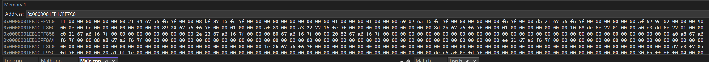
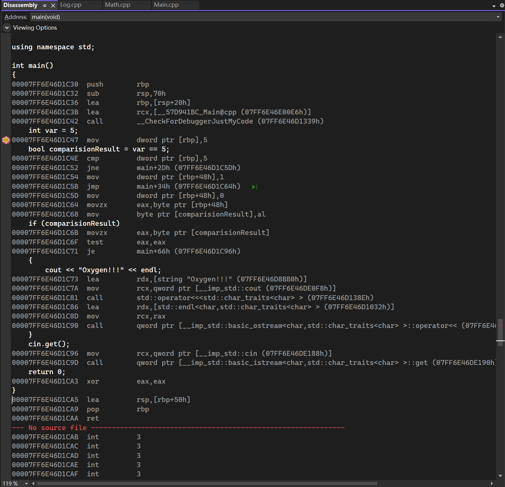
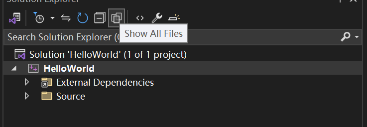
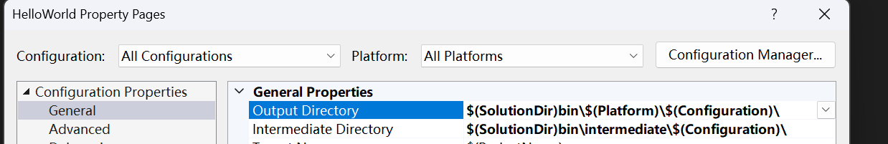
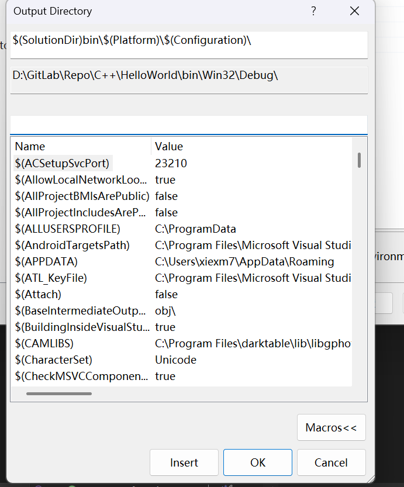

# TheCherno C++ Lessons

## How The C++ Compiler Works

### C++ Compiler's responsibility

1. pre-processing .cpp file such as #include(copy & paste), #define, #if #ifdef

2. generate .obj file for every compiling unit.

3. optimize your code.

### An example of what ```#include``` doing (trust me, it's just coping and pasting)

Suppose now we have these two source files.

```C++ {.line-numbers}
// Math.h
}

// Yes, this file just have an end brace, nothin else.

// Main.cpp

int main()
{
    int reuslt = 1;
#include "Math.h"

```

Press ctrl + F7 and compile the Main.cpp and ***you will find that the compiling is successful!!!***

Select Project -> Properties -> C/C++ -> Preprocess -> Preprocess to a file -> Yes

Press ctrl + F7 to re-compile the Main.cpp

Now you can find Main.i file in the following path:

```Bash
D:\GitLab\Repo\C++\HelloWorld\HelloWorld\x64\Debug
```

Open this Main.i, you can see that:

```C++ {.line-numbers}
#line 1 "D:\\GitLab\\Repo\\C++\\HelloWorld\\HelloWorld\\Mian.cpp"

int main()
{
    return 0;
#line 1 "D:\\GitLab\\Repo\\C++\\HelloWorld\\HelloWorld\\Math.h"
}
#line 6 "D:\\GitLab\\Repo\\C++\\HelloWorld\\HelloWorld\\Mian.cpp"
```

Yes, the compiler copied the whole Math.h file and pasted where the ```#include``` is. Simply lovely.

### What is compiling unit, is it true that a .cpp file is a compiling unit?

Generally, a compiling unit will produce a .obj file.

But it doesn't mean that a .cpp file is a compiling unit.

A .cpp file is just something that we can feed code to the compiler.

Actually a .cpp file can be serveral compile units.

Yes, you can ```#include``` serveral .cpp files a .cpp file. See <https://chatgpt.com/share/68286e49-7274-800f-8b34-3b705777d0b8>

### An example that compiler can optimize your code

Suppose that we have this source file:

```C++ {.line-numbers}
// Math.cpp
int Add()
{
    return 5 + 2;
}
```

1. Select ***Project -> HelloWorld properties -> C/C++ -> Optimization -> Maximum Optimization(Favor Speed)***

2. Remember to close basic runtim check by selecting ***Project -> HelloWorld properties -> C/C++ -> Code Generation -> Basic Runtime Check -> Default***. Otherwise, you may get a "Build Failed".

3. Select ***Project -> HelloWorld properties -> C/C++ -> Output Files -> Assembler output -> Assembly Only Listing.***

Now, you can see a Math.asm file in the path :

```Bash
D:\GitLab\Repo\C++\HelloWorld\HelloWorld\x64\Debug
```

And from this assembly file, you can see the assembly code of function Add :

```C++ {.line-numbers}
?Add@@YAHXZ PROC; Add, COMDAT
; File D:\GitLab\Repo\C++\HelloWorld\HelloWorld\Math.cpp
; Line 2
$LN4:
    sub rsp, 40; 00000028H
    lea rcx, OFFSET FLAT:__67D1A559_Math@cpp
    call    __CheckForDebuggerJustMyCode
    mov eax, 7
; Line 4
    add rsp, 40; 00000028H
    ret 0
?Add@@YAHXZ ENDP; Add
_TEXT  ENDS
END
```

You can see that the compiler computed the result of 5 + 2 while compiling instead of storing the constant values 5 and 2 in the register :

```C++ {.line-numbers}
mov eax, 7
```

This kind of optimization is so-called "constant folding".

## Variables in C++

### How much space does a boolean variable take in memory?

Actually, although 1 bit of memory space is enough for a boolean to present, it takes 1 byte of space in memory.

Because **computer addressing memory by byte, not by bit**, that's it.

## C++ Header Files

### What is the difference between head files with .h extension and head files without?

Head files with .h head files are c head files, otherwise, they are c++ head files. Commonly seen in the c standard libs header files and c++ standard libs header files.

## How to debug C++ in Visual Studio 2022

### Viewing memory

```C++ {.line-numbers}
int main()
{
	int variable = 17;
    variable++;

    return 0;
}
```

Add a breakpoint in the following line (**<font color="gold">remeber to turn off the optimization!!!</font>**):

```C++ {.line-numbers}
variable++;
```

Start debuging, stop at the breakpoint.

Choose Debug -> Windows -> Memory -> Memory 1/2/3

Type "&variable" inside "Adress" -> Enter

Now you should see the memory content of the variable "variable" below.



### Viewing Disassembly Code

**<font color = "gold">Under debug, when your program runs into a breakpoint</font>**，you can check the assemably code by two ways.

One way by right clicking the mouse and selecting the "Go to Disassembly" option of the menu.

Another way is the shortcut-keys way. Press Ctrl+K, and then press G. Remeber releasing after pressing Ctrl+K.

You can see the following window if there's no accidents.



## Setup Your C++ Projects in Visual Studio 2022

### Filters VS Folders

There are filters in Visual Studio. Filters are something that Visual Studio helps you to classify your files. They are not existed in your disk.

Folders are real folders that created actual folders in your disk.

Your can treat filters as virtual folders.

The following button supply you a way to switch between filters'view and folders'view.



### Setup Directories For Different Kinds Of Output Files

Two output directoires are suggested to config in order to manager your project.

The first one is the "Output Directory", and the secord one is the "Intermediate Directory".

Choose Project -> YourProject Properties -> General

Setup the above configurations as the following:



You can check the meanings of all the macros that vs 2022 provides for you here.



## Pointer VS Reference

|feature|pointer|reference|
|-------|-------|---------|
|can be null|yes|no, **must be binded after created**|
|can be rebinded|yes|no, **can be binded just one time**|
|usage|*/&|just like a variable|
|initialization|no need to initialize when created|**must be initialized when created**|
|space|take up space in memory(32 bits for 32-bit applications, 64 bits for 64-bit applications)|**no space occupied in memeory**|

see: <https://chatgpt.com/s/t_6857c520e1b0819191a1d525ce030d7a>

## Static in C++

### Staic Outside Class And Struct

Static variables or functions outside class and struct. This kind of variables or functions can be used within the compiling unit where they are defined for linking. For example:

```C++ {.line-numbers}
// math.cpp
static int s_Variable = 7; // s_Varible can be "seen" by the linker within this file
int g_Variable = 77; // g_Variable is a global variable and can be "seen" across different cpp files (or compiling unit)

// main.cpp
...
static int s_Variable = 17;
extern int g_Variable; // important, witouth this statement, we'll get an error, undefined idtifiner

int main()
{
   cout << s_Variable << endl; // print 17
   cout << g_Variable << endl; // print 77 
}

```

If

```C++ {.line-numbers}
// math.cpp
static int s_Variable = 7;
int g_Variable = 10;

// log.cpp
int g_Variable = 17;

// main.cpp
...
extern g_Variable;
int main()
{
   cout << g_Variable << endl; // linking error : one or more multiply defined symbols found 
}
```

Anyway, "static" can be treated like "private" of class and struct. Just remember that static variables and functions have internal linkage. **And this means that you should not declare static variabels or functions inside a header file!!!**

### Static Inside Class and Struct

1. Static variables in class and struct are shared by all objects instanced from the class and struct.

2. Static functions in class can only be called with the class name, but not an object.

3. **Static functions can not access non-static member variables.**

## The Use Of Vitual Function

### Normal Virtual Functions

Example:

```C++ {.line-numbers}
class Entity
{
public:
	virtual void GetName() // the key word virtual decalres that this function is a virtual function
	{
		cout << "Entity" << endl;
	}
};

class Player : public Entity
{
public:
	void GetName() override // the key word "override" is highly recommended after C++11 standard
	{
		cout << "Player" << endl;
	}
};
```

Functions those can be overrided should be declared "virtual".

### Pure Virtual Functions

1. Virtual functions are allowed to be undefined.

2. Classes with undefined virtual function(s) can not be instantiated. If virtual functions are all defined in the parent class, subclass can be instantiated.

Example:

```C++ {.line-numbers}
class Printable
{
public:
	virtual void PrintClassName() = 0;
};

class Entity : Printable
{
public:
	void PrintClassName() override
	{
		cout << "Entity" << endl;
	}
};

class Player : public Entity
{
public:
	void PrintClassName() override
	{
		cout << "Player" << endl;
	}
};

void PrintClass(Printable* object)
{
	object->PrintClassName();
}

int main()
{
    Printable pp* = new Printable; // compiling error: 'Printable': cannot instantiate abstract class
    return 0;
}
```

## Visibility In C++

Thera are 3 types of visibility for members, including variables and functions, of a class in C++. They are **private**, **protected**, **public**.

**Protected** members are more visiable than **private** members but less than **public** members.

You can not access  **private** members with objects or inside a subclass (except for **friend**). But you can actually access  **protected** members in a subclass. objects still can not.

**<font color = gold>There is one thing you should know that visibility has nothing to do with the performance of your code. Visibility isn't something that a CPU concerns about.</font>**

Let's take "private" as an example. When you make a member be private. You are reminding yourself or other developers that this member should only use inside this class. Considering the code following:

```C++ {.line-numbers}
// Panel.h
class Panel{
private:
	int m_X,m_Y;
	void Refresh();
public:
	void SetPositionX(int PosX);
	void SetPositionY(int PosY);
	...
}

// Panel.cpp
void Panel::SetPositionX(int PosX)
{
	m_X = PosX;
	Refresh();
}

void Panel::SetPositionY(int PosY)
{
	m_Y = PosY;
	Refresh();
}
```

Making ```m_X``` and ```m_Y``` be private force other developers who want to set the position of an UI panel to call SetPositionX and SetPositionY rather than just set the value of the variable members. Because ```SetPositionX``` and ```SetPositionY``` also call ```Refresh``` to refresh the panel. If you just set the value of the variabel members you may forget the refresh.

## (Raw) Array

There two ways for you to declare an array in C++. For example:

```C++ {.link-numbers}
int ArrayOfSize7[7];
int* AnotherArrayOfSize7[7] = new int[7];
```

The differcens between them is which area they are created in memory.

```C++ {.link-numbers}
int ArrayOfSize7[7]; // created in stack
int* AnotherArrayOfSize7[7] = new int[7]; // create in heap
```

Created in stack means you don't nedd to delete it yourself, because the scope of the life time of the array created in stack ends with the scope.

However, array created in heap will exist throughout the running program and means that you need to delete it yourself otherwise there may be memory leak.

Here is an example of what not to do with a array created in stack.

```C++ {.line-numbers}
int* GenerateArrayOfSize7()
{
	int Array[7];
	
	for (int i = 0; i < 7; i++)
		Array[i] = 7;

	return Array;
}

int main()
{
	int* ArrayPointer = GenerateArrayOfSize7(); // BIG ISSUE!!!
	cout << ArrayPointer[0] << endl;
	return 0;
}
```

The problem is in the GenerateArrayOfSize7() function.

It declares a local array int ```Array[7]``` on the stack, fills it with values, and then returns a pointer to this local array.

However, when the function exits, the local array goes out of scope and is destroyed. The memory that ```Array``` occupied is no longer valid.

When ```main()``` tries to access ```ArrayPointer[0]```, it's attempting to read from memory that may have been deallocated or reused for other purposes. This is **undefined behavior** - the program might appear to work sometimes, crash other times, or produce garbage values. Use heap array instead of stack array.

Always be careful with a function that return a local pointer.

By the way, there are no (normal) ways for you to get the number of elements of an array. But you can do with some tricks(not recommended). For example:

```C++ {.line-numbers}
int array[5];
int count = sizeof(array) / sizeof(int);
```

The function ```sizeof``` returns how many bytes of an variable or a type.

This would not work for heap arrays.

```C++ {.line-numbers}
int* array = new int[5];
int count = sizeof(array) / sizeof(int)
```

In this code, ```sizeof(array)``` will return the size of the pointer variable array, which is 8 in 64-bit operating system, rather than the size of the array it points to.

Lastly, the C++ standard library provides you a class named ```array```, it's much more safer and convinent for you to use. But also when it comes to performance, raw array is always better. Whicn one to use is up to you.

You want performance? Then use raw array, but carefully.

You want convinence and safety? Then choose array from the standard library and make your life eaiser.

## String Literals In C++

First of all, remember that the type of string literals are ```const char[]```. You can't assign an string literal to a variable of type ```const char*``` after may be C++11. For example:

```C++{.line-numbers}
char* name = "Jason"; // baned, compiling error
char name[] = "Jason"; // this is ok.
```

The difference between line 1 and line 2 is whether new memories are allocated. Line 2 obviously allocated new memories and copy the content of the string literal to the new memories.

Types of char and their size:

|Type|Size|
|----|----|
|char|1 bytes|
|wchar_t|1/2/4 bytes, depend on your operating system, usually 2 or 4 bytes, exp. 2 bytes in windows, 4 bytes in linux and macOS|
|char16_t|2 bytes|
|char32_t|4 bytes|

## Const In C++

Function members of classes with const:

```C++{.line-numbers}
// MyClass.h
#pragma once

class Entity
{
private:
    int m_X, m_Y;
public:
    int GetterX() const;
    int GetterY() const;
    Entity(int x, int y);
};


// MyClass.cpp
#include "MyClass.h"

int Entity::GetterX() const
{
    return m_X;
}

int Entity::GetterY() const
{
    return m_Y;
}

Entity::Entity(int x, int y)
{
    m_X = x;
    m_Y = y;
}
```

```const``` means that this member function won't (and can't) change any data memebres (except mutable variable) within the function.

One thing you need to know is that const obejcts can't call non-const function members. Because non-const function members can't guarantee that they won't change data members within the funtion. For example:

```C++{.line-numbers}
// main.cpp
// MyClass.h
#pragma once

class Entity
{
private:
    int m_X, m_Y;
public:
    int GetterX();
    int GetterY() const;
    Entity(int x, int y);
};


// MyClass.cpp
#include "MyClass.h"

int Entity::GetterX()
{
    return m_X;
}

int Entity::GetterY() const
{
    return m_Y;
}

Entity::Entity(int x, int y)
{
    m_X = x;
    m_Y = y;
}

// main.cpp
int main()
{
	const Entity e;
	cout << e.GetterX << endl; // error.Cannot convert this argument from type const Entity to type Entity: function is missing const qualifier
}
```

Well, you can change data members which with the key word ```mutable``` even in ```const``` member functions. For example:

```C++{.line-numbers}
// MyClass.h
#pragma once

class Entity
{
private:
    int m_X, m_Y;
	mutable int callingCount;
public:
    int GetterX() const;
    int GetterY() const;
    Entity(int x, int y);
};


// MyClass.cpp
#include "MyClass.h"

int Entity::GetterX() const
{
	callingCount++; // This is OK because callingCount is mutable
    return m_X;
}

int Entity::GetterY() const
{
    return m_Y;
}

Entity::Entity(int x, int y)
{
    m_X = x;
    m_Y = y;
}

```

## Member Initializer List

Usage of member initializer list:

```C++{.line-numbers}
// MyClass.h
class Entity
{
private:
    std::string m_Name;
    int m_Number;
public:
    Enitty();
    const std::string& GetEntityNameString();
};

// MyClass.cpp
#include "MyClass.h"

Entity::Entity()
    : m_Name(std::string("Unknown")), m_Number(-1) 
    // The members' order here should be exactly same as their declaration order in MyClass.h!!! Don't do this:
    // m_Number(-1), m_Name(std::string("Unknown"))
{
    // Do other things for initialization
    ...
}

const std::string& GetEntityNameString()
{
    return m_Name;
}
```

Attention! As the comment says, data members' order in initializer list should be exactly same as their declaration order. Because data members are initialized by order according to their declaration order!!!

Why should we use initializer list? Well, it's not just about coding style but alose about performance. For example:

```C++{.line-numbers}
// MyClass.h
#include <string>

class Example
{
public:
    Example();
    Example(int variable);
};

class Entity
{
private:
    std::string m_Name;
	Example m_Example;
public:
    Entity();
    const std::string& GetEntityName();
};

// MyClass.cpp
#include "MyClass.h"

Entity::Entity()
    : m_Name(std::string("Unknown")), m_Example(Example(17))
{
    // Do other things for initialization
}

const std::string& Entity::GetEntityName()
{
    return m_Name;
}

Example::Example()
{
    std::cout << "Default constructor called" << std::endl;
}

Example::Example(int variable)
{
	std::cout << "Constructor with variable: " << variable << std::endl;
}


// Main.cpp
#include <iostream>
#include "MyClass.h"

int main()
{
	Entity e;
	
	return 0;
}
```

The output of this code will be:
**Constructor with variable: 17**

But if we change the default constructor of Entity like this:

```C++{.line-numbers}
Entity::Entity()
    : m_Name(std::string("Unknown"))
{
    m_Example = Example(17);
    // Do other things for initialization
}
```

The output will be:
**Default constructor called.**
**Constructor with variable: 17**

Now you can see the difference between them. The second code will need to create a temporary object of ```Example``` but the first code just create the member object ```m_Example```.
