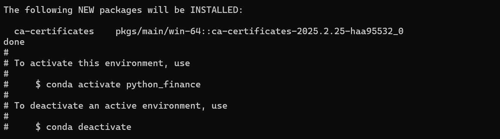
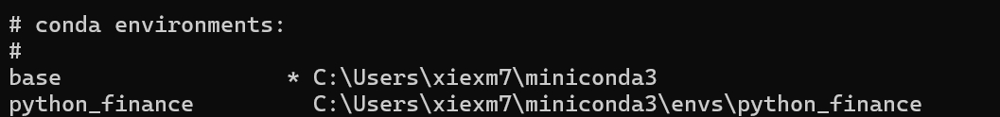
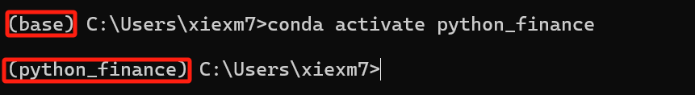
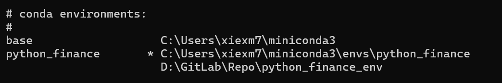

# 使用Miniconda部署Python虚拟环境

## What is Miniconda

Miniconda的作用简单来说就是用来创建不同的python环境的。假如，你在github上面看到一个用python编写的，屌炸天的量化分析工具。于是乎，git fork，git init ，git remote add，git pull，一气呵成，把代码弄到本地，想在本地跑一下看看效果。结果你发现，项目使用python3写的，但是，你本地的环境却是python2，根本跑不起来。

出于对这个开源项目的爱，你决定再在本地安装一个python3的运行环境。但是，一想到之后有两个系统级的python环境，每次都得区分python3，python。天生洁癖的你霎时间无法接受，再者，除了python3，你还需要安装一堆这个项目依赖的库。你很绝望，想要放弃。

就在你想放弃的时候，你在项目的readme.md文件中，发现了一个叫Miniconda的单词。于是，你打开了搜索引擎，点开了Miniconda的官方网站。

花费了一些时间搜索，你知道了原来miniconda可以在本地独立于现有的python环境，构建一个独立的python环境。你可以在你构建的这个环境中安装各种你需要的东西，python3，numpy，pandas各种库等，而不会影响现在系统中的python环境。

二话不说，下载，安装，一气呵成。

## 在Miniconda中创建独立的Python环境

安装完成后，你打开了Anaconda Prompt，这个一个conda命令窗口。

照着官方的guidance，你尝试在本地创建一个独立的python环境

```
bash

conda create -n python_finance python=3.7
```



接着，你输入了下面这个指令来确认环境

```
bash

conda info --env
```


可以看到，现在多了一个叫做python_finance的虚拟环境。你满心欢喜地敲了下面这个指令，把环境切换到新创建出来的那个

```
bash 

conda activate python_finance
```


嘿嘿，环境从原来的base切换到python_finance了

你突然发现，所有创建出来的环境都位于`C:\Users\xiexm7\miniconda3\envs\`这个路径下，你发现自己的C盘快爆了，想着能不能把环境创建到另外一个路径下。你又搜索了一番，发现可以这么搞

```
bash

conda create -p D:\GitLab\Repo\python_finance_env python=3.7

or

conda create --prefix=D:\GitLab\Repo\python_finance_env python=3.7
```



如你所愿，在指定路径下生成了一个新的环境。但是，新的环境并没有一个缩略名，切换环境的时候需要你填写完整的路径

```
bash

conda activate D:\GitLab\Repo\python_finance_env
```

好了，你觉定先把之前默认路径下的环境删除了

```
base

# --all means removing the env completely, including all installed packages
conda remove -n python_finance --all
```

接下来，你切换到另一个环境安装一些需要用到的库

```
bash

conda install numpy
conda install -y ipython pandas matplotlib pytables scikit-learn
```

支持，python的虚拟独立环境的创建打工搞成，你可以愉快地学习了。

## conda 常用指令总结

### 环境创建，删除，切换，重命名
```
bash

conda create -n env_name # 创建环境（默认路径）
conda create -p env_path # 创建环境（自定义路径）

conda info --env # 列出所有已创建地环境

conda activate env_name
conda activate env_path

conda deactivate

conda rename -n old_env_name new_env_name
conda rename -p old_env_path new_env_path

conda remove -n env_name --all # 删除整个环境，包括环境已安装的所有库
```

### 库的安装
```
bash

conda install package_name [package_name_1] [package_name_2] [...]
conda remvove package_name
conda update packagae_name
conda list # 列出安装的所有库
```